

  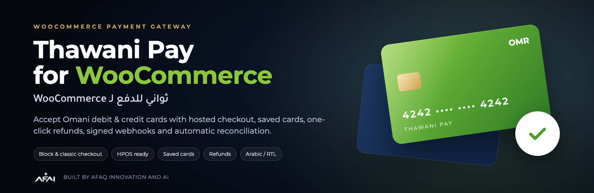

  <a href="README.md">English</a> · <b>العربية</b>

<h3 align="center">اقبل مدفوعات البطاقات البنكية والائتمانية العمانية في متجرك باحتراف.</h3>

  يدفع عميلك في صفحة ثواني الآمنة، ويعود إلى طلب مؤكَّد، وتدير أنت كل شيء من لوحة ووردبريس: 
  الاسترداد، والبطاقات المحفوظة، والاشتراكات، ومتابعة المعاملات لحظة بلحظة.

  <a href="https://github.com/afaq-innovation-ai/thawani-pay-for-woocommerce/releases/latest"><b>⬇️ تحميل أحدث إصدار</b></a>
  &nbsp;·&nbsp;
  <a href="#-ابدأ-خلال-5-دقائق"><b>🚀 ابدأ الآن</b></a>
  &nbsp;·&nbsp;
  <a href="#-جولة-مصورة"><b>📸 الصور</b></a>

  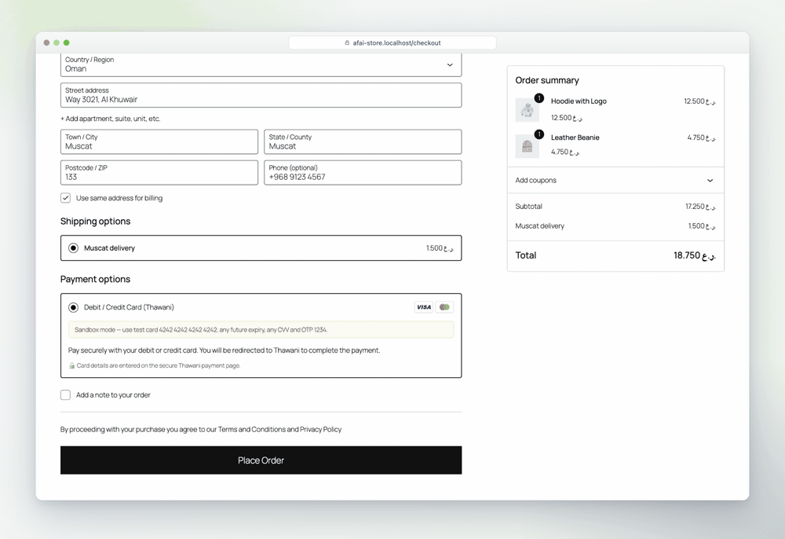

---

## ✨ ماذا تقدم الإضافة؟

<table>
<tr>
<td width="33%" valign="top">

### 💳 دفع بالبطاقات بالريال العماني
يدفع العميل ببطاقة Visa أو Mastercard، بنكية كانت أو ائتمانية، في صفحة ثواني الآمنة. لا تمر بيانات البطاقة على خادمك إطلاقا.

</td>
<td width="33%" valign="top">

### ✅ لا دفعة تضيع
يُؤكَّد كل طلب بثلاث طرق: عند عودة العميل، وعبر إشعار موقَّع من ثواني، وبفحص دوري في الخلفية. يُسجَّل الدفع حتى لو أغلق العميل الصفحة.

</td>
<td width="33%" valign="top">

### ↩️ استرداد بنقرة واحدة
استرداد كامل أو جزئي من شاشة الطلب مباشرة. يعود المبلغ عبر ثواني ويُحفظ رقم الاسترداد في الطلب.

</td>
</tr>
<tr>
<td valign="top">

### 🔁 محفظة البطاقات
تظهر البطاقات المحفوظة في «حسابي» كبطاقات بنكية حقيقية: ألوان العلامة، والاسم، وآخر أربعة أرقام، وتاريخ الانتهاء. يستطيع العميل تسميتها، واختيار الافتراضية، وحذفها، ثم الدفع بنقرة ورمز تحقق.

</td>
<td valign="top">

### 📅 الاشتراكات
باقات شهرية أو سنوية عبر إضافة *Subscriptions for WooCommerce* المجانية. يُخصم التجديد من البطاقة المحفوظة، ويُرسَل للعميل رابط سداد متى تطلَّب الأمر رمز تحقق.

</td>
<td valign="top">

### 📊 لوحة المعاملات
عرض مباشر لجلسات الدفع في ثواني: المبلغ المحصَّل، والمدفوع، وما ينتظر الدفع، والملغى. مع بحث وتصفية، وكل معاملة مرتبطة بطلبها.

</td>
</tr>
<tr>
<td valign="top">

### 🧾 تفاصيل واضحة لكل طلب
لوحة ثواني في كل طلب: المبلغ، والحالة، والبطاقة، ورقم الدفعة، والفاتورة، والمبالغ المستردة، مع زر «مزامنة مع ثواني».

</td>
<td valign="top">

### 🛡️ أمان من الأساس
تتحقق الإضافة من كل دفعة مباشرة مع واجهة ثواني ولا تثق بالمتصفح. كما تطابق المبالغ وتتحقق من توقيع الإشعارات وتمنع الخصم المزدوج.

</td>
<td valign="top">

### 🇴🇲 عربية بالكامل
ترجمة عربية كاملة للإعدادات وصفحة الدفع والرسائل وملاحظات الطلب، مع دعم تلقائي للاتجاه من اليمين إلى اليسار.

</td>
</tr>
<tr>
<td valign="top">

### 🧱 تعمل مع أي صفحة دفع
تدعم صفحة الدفع الحديثة بالمكوّنات (Blocks) وصفحة الدفع الكلاسيكية، ومتوافقة مع نظام تخزين الطلبات الجديد (HPOS).

</td>
<td valign="top">

### 🧪 بيئة تجريبية جاهزة
جرِّب فورا بمفاتيح ثواني التجريبية العامة وبطاقات الاختبار، ثم انتقل إلى البيئة الفعلية بمفتاح واحد بعد اعتماد ثواني.

</td>
<td valign="top">

### ⚙️ إعداد في دقائق
شاشة إعدادات فيها لوحة حالة مباشرة تعرض الاتصال بثواني، والإشعارات، وعملة المتجر، والبطاقات المحفوظة بنظرة واحدة.

</td>
</tr>
</table>

---

## 📸 جولة مصورة

### لصاحب المتجر

<table>
<tr>
<td width="50%" valign="top">
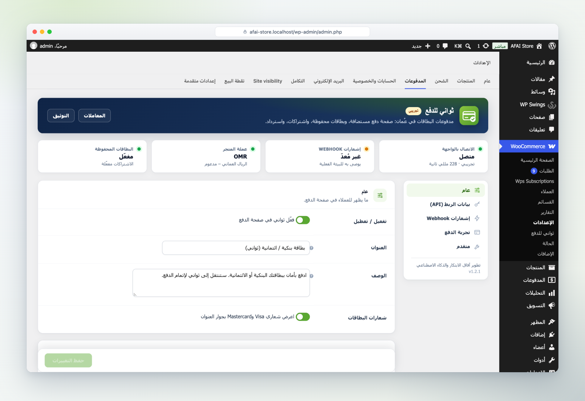

<b>الإعدادات ولوحة الحالة</b> الاتصال، والإشعارات، والعملة، والبطاقات المحفوظة بنظرة واحدة.

</td>
<td width="50%" valign="top">
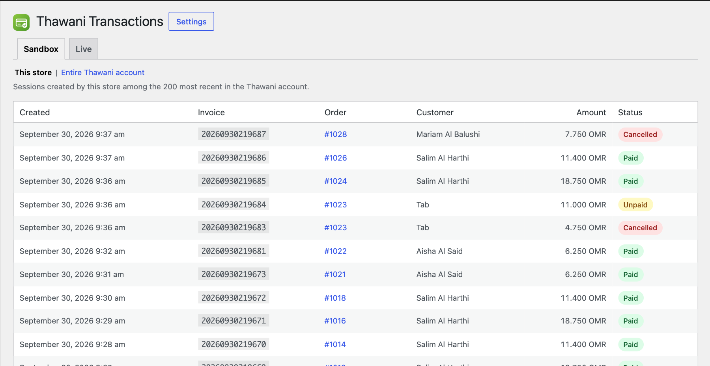

<b>لوحة المعاملات</b> المبلغ المحصَّل والحالات، مع بحث وتصفية، وربط مباشر بالطلبات.

</td>
</tr>
<tr>
<td valign="top">
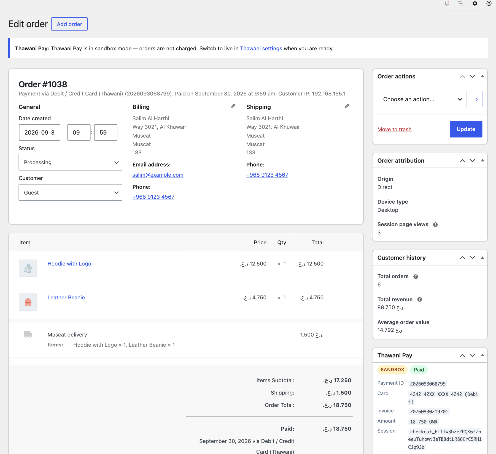

<b>لوحة ثواني في كل طلب</b> المبلغ والبطاقة ورقم الدفعة والفاتورة، وسجل كامل في الملاحظات.

</td>
<td valign="top">
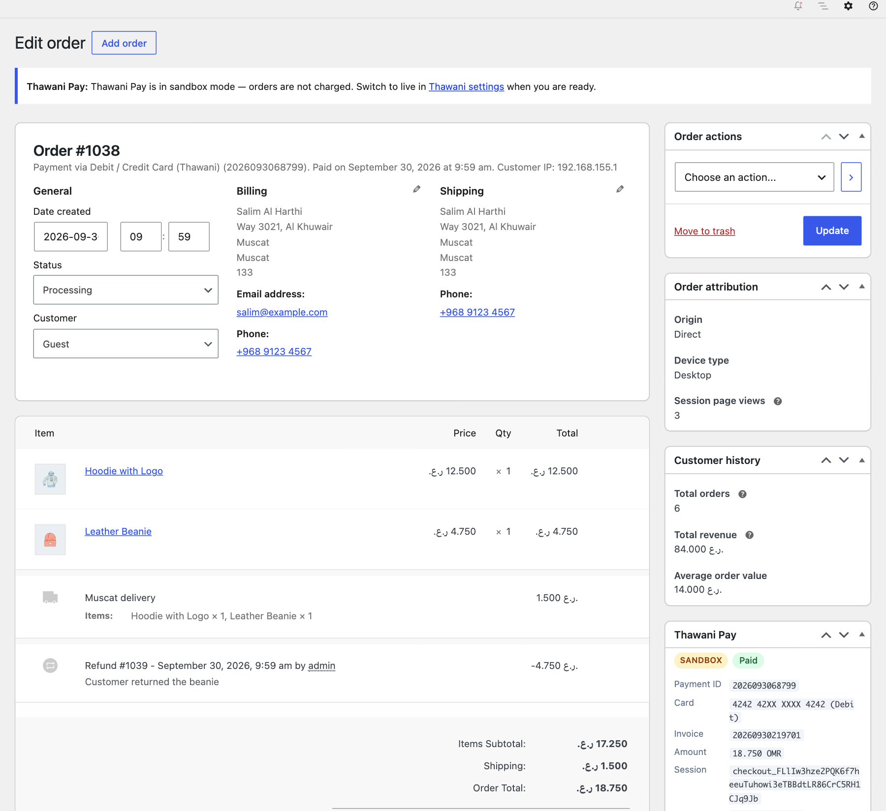

<b>استرداد بنقرة واحدة</b> استرداد جزئي عبر ثواني يُسجَّل تلقائيا في الطلب.

</td>
</tr>
</table>

### للعميل

<table>
<tr>
<td width="50%" valign="top">
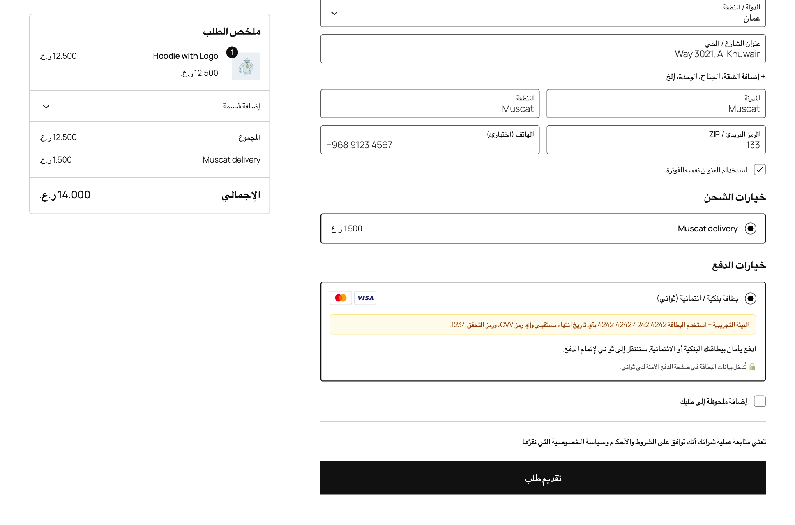

<b>١ · صفحة الدفع</b> خيار واضح للدفع بالبطاقة مع شعاري Visa وMastercard.

</td>
<td width="50%" valign="top">
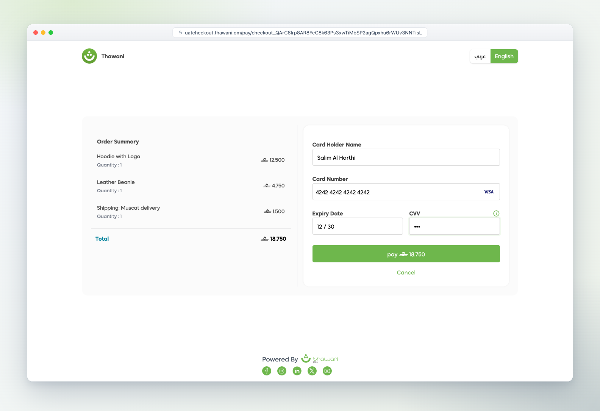

<b>٢ · صفحة ثواني الآمنة</b> ملخص مفصَّل للطلب: المنتجات والشحن.

</td>
</tr>
<tr>
<td valign="top">
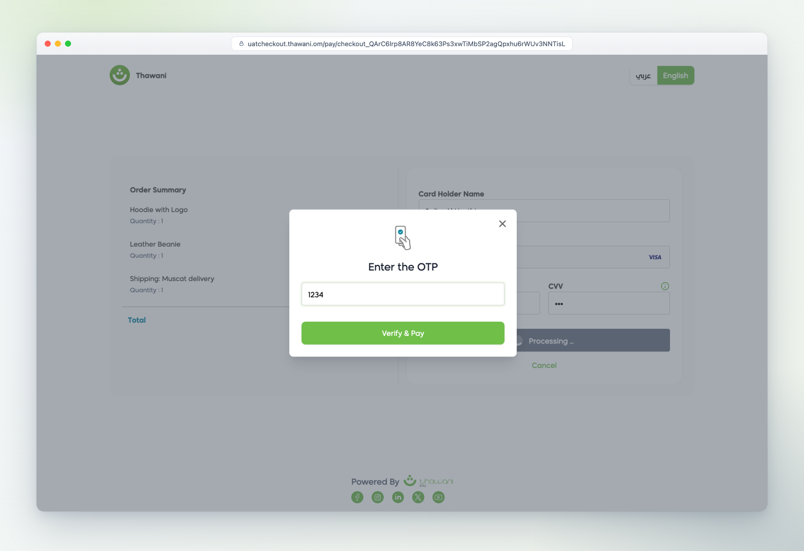

<b>٣ · رمز التحقق من البنك</b> يؤكد حامل البطاقة الدفع بالرمز المرسل من بنكه.

</td>
<td valign="top">
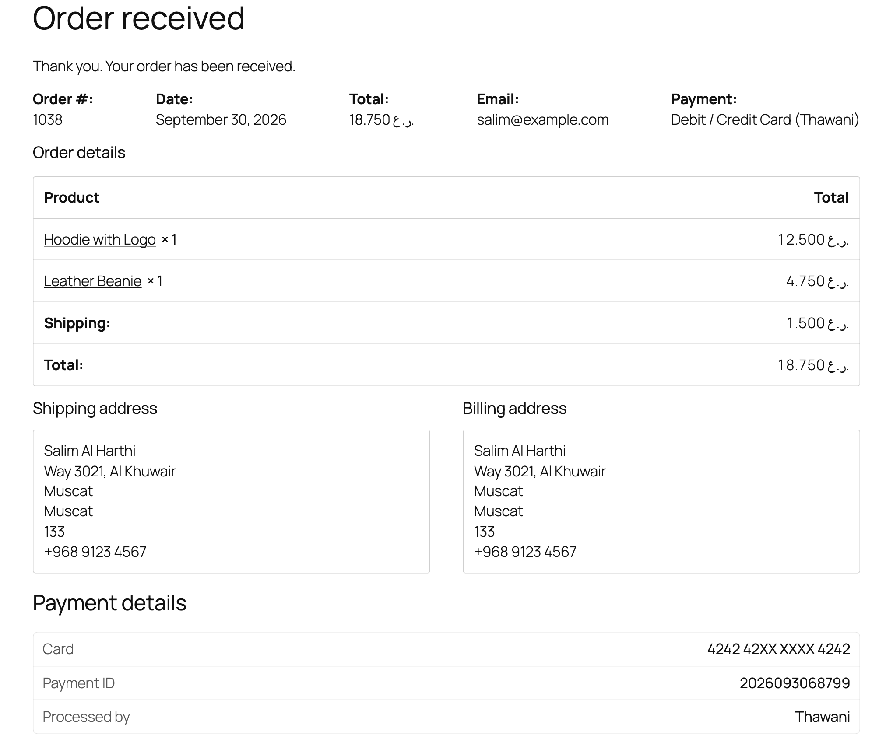

<b>٤ · طلب مؤكَّد</b> البطاقة المستخدمة ورقم الدفعة في صفحة الشكر.

</td>
</tr>
</table>

### محفظة البطاقات

  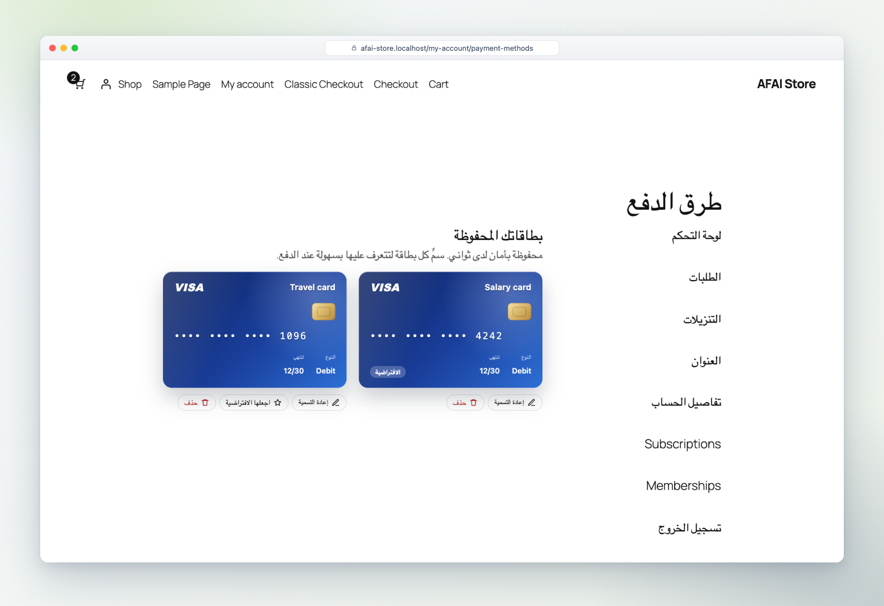
   <b>البطاقات المحفوظة بشكل بطاقات بنكية</b> ألوان العلامة، واسم البطاقة، وآخر الأرقام، والنوع، وتاريخ الانتهاء، مع شارتي «الافتراضية» و«منتهية».

<table>
<tr>
<td width="33%" valign="top">
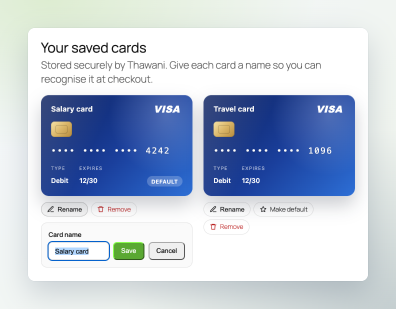

<b>سمِّ بطاقتك كما تريد</b> «بطاقة الراتب»، «بطاقة السفر»… يظهر الاسم في كل مكان حتى صفحة الدفع.

</td>
<td width="33%" valign="top">
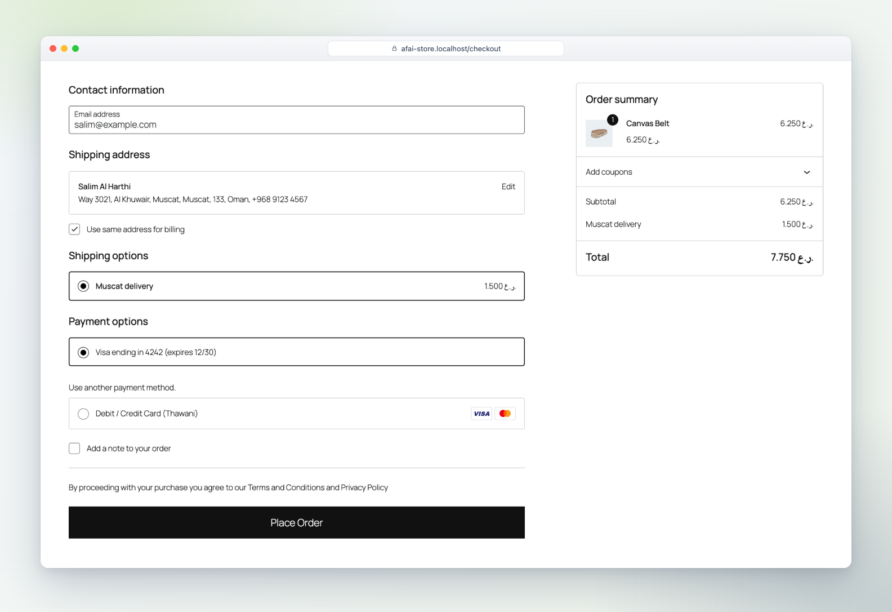

<b>اختر البطاقة باسمها عند الدفع</b> نقرة واحدة ثم رمز التحقق من البنك.

</td>
<td width="33%" valign="top">
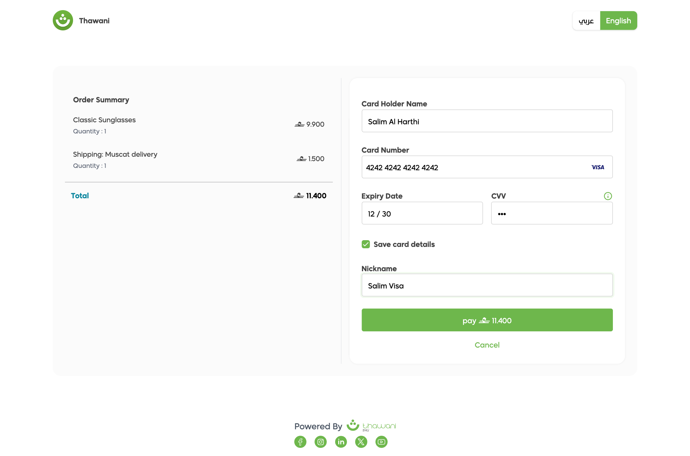

<b>محفوظة بأمان لدى ثواني</b> يُستورد الاسم المختار في صفحة ثواني تلقائيا.

</td>
</tr>
</table>

### الاشتراكات

<table>
<tr>
<td width="33%" valign="top">
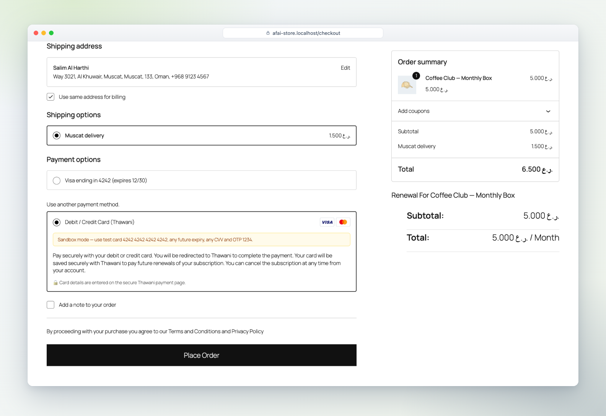

<b>الاشتراك</b> تُحفظ البطاقة للتجديدات القادمة.

</td>
<td width="33%" valign="top">
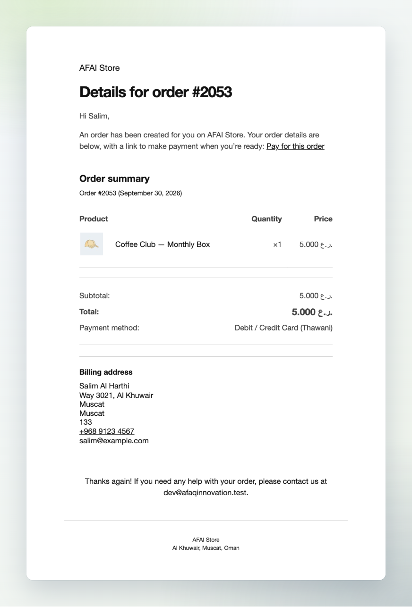

<b>رابط التجديد</b> يُرسَل تلقائيا متى تطلَّب الدفع رمز تحقق.

</td>
<td width="33%" valign="top">
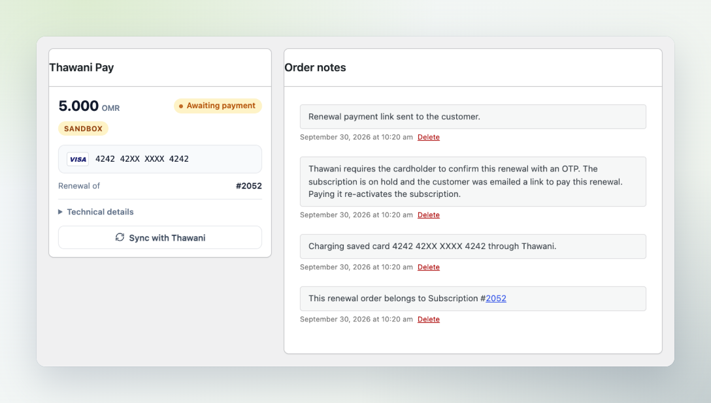

<b>سجل كامل للتجديد</b> كل خطوة موثقة في الطلب.

</td>
</tr>
</table>

---

## 🚀 ابدأ خلال 5 دقائق

**المتطلبات:** ووردبريس 6.2 أو أحدث، وWooCommerce 8.0 أو أحدث، وPHP 7.4 أو أحدث، وعملة المتجر **الريال العماني (OMR)**.

1. **التثبيت.** حمِّل ملف الإضافة من [صفحة الإصدارات](https://github.com/afaq-innovation-ai/thawani-pay-for-woocommerce/releases/latest)، ثم ارفعه من **الإضافات ← أضف جديد ← رفع إضافة** واضغط **تفعيل**.
2. **فتح الإعدادات.** انتقل إلى **WooCommerce ← الإعدادات ← المدفوعات ← ثواني للدفع** وفعِّل الإضافة في صفحة الدفع.
3. **التجربة في البيئة التجريبية.** المفاتيح التجريبية مُدخلة مسبقا. نفِّذ طلبا تجريبيا وادفع بالبطاقة `4242 4242 4242 4242` بأي تاريخ انتهاء مستقبلي وأي رمز CVV، ورمز التحقق `1234`.
4. **ربط الإشعارات (موصى به).** انسخ **رابط Webhook** من الإعدادات إلى بوابة التاجر في ثواني، ثم الصق السر في الإضافة.
5. **الانتقال إلى البيئة الفعلية.** عندما تصلك مفاتيح ثواني الفعلية، أدخلها في حقول **البيئة الفعلية**، واضغط **اختبار المفاتيح الفعلية**، ثم عطِّل **البيئة التجريبية**.

<b>بطاقات الاختبار</b>

| رقم البطاقة | النتيجة | رمز التحقق |
|---|---|---|
| `4242 4242 4242 4242` | تُقبل دائما | `1234` |
| `4000 0000 0000 0002` | تُرفض دائما | `1234` |
| `4456 5300 0000 1096` | تحقق 3-D Secure (ائتمانية) – تُقبل | `1234` |
| `4456 5300 0000 1104` | تحقق 3-D Secure (ائتمانية) – تُرفض | `1234` |

استخدم أي تاريخ انتهاء مستقبلي وأي رمز CVV.

<b>متطلبات ثواني للانتقال إلى البيئة الفعلية</b>

| متطلب ثواني | كيف تلبيه الإضافة |
|---|---|
| شهادة SSL | تنبيه في لوحة التحكم إذا فُعِّلت البيئة الفعلية دون HTTPS. |
| إرسال اسم العميل ورقم التواصل والبريد الإلكتروني | تُرسَل تلقائيا مع كل عملية دفع. |
| توضيح قبول الدفع بالبطاقات في صفحة الدفع | عنوان افتراضي «بطاقة بنكية / ائتمانية (ثواني)» مع وصف وشعارات البطاقات. |
| إعداد رابط Webhook | رابط جاهز للنسخ في الإعدادات، ويُتحقق من كل إشعار بالسر الخاص به. |

<b>إعداد الاشتراكات</b>

1. ثبِّت إضافة **[Subscriptions for WooCommerce](https://wordpress.org/plugins/subscriptions-for-woocommerce/)** المجانية من WP Swings وفعِّلها.
2. أنشئ منتج اشتراك، مثل 5 ريالات شهريا.
3. لا شيء آخر. تظهر ثواني للدفع تلقائيا لطلبات الاشتراك، وتُحفظ البطاقة، ويُخصم كل تجديد منها.

تطلب ثواني حاليا رمز تحقق من حامل البطاقة عند كل خصم من بطاقة محفوظة. متى احتاج التجديد إلى ذلك، يُعلَّق الاشتراك ويصل
العميل بريد فيه رابط «ادفع لهذا الطلب». بنقرة واحدة ورمز التحقق يعود الاشتراك نشطا. وإذا فعَّلت ثواني الخصم دون رمز تحقق
في حسابك، تصبح التجديدات تلقائية بالكامل دون أي تغيير من جهتك.

إضافة *WooCommerce Subscriptions* الرسمية المدفوعة غير مدعومة حاليا.

---

## 🔒 الموثوقية والأمان

- **لا تثق بالمتصفح.** لا يُحدَّث الطلب إلا بعد التحقق من الدفع مع واجهة ثواني مباشرة.
- **مطابقة المبلغ.** إذا اختلف المبلغ المدفوع عن قيمة الطلب، يُعلَّق الطلب للمراجعة بدل تنفيذه.
- **تسجيل الدفع مرة واحدة فقط.** قفل داخلي يمنع المعالجة المزدوجة إذا وصلت العودة والإشعار والفحص الدوري في اللحظة نفسها.
- **إشعارات موقَّعة.** تحقق من توقيع HMAC-SHA256 ومنع لإعادة إرسال الإشعارات القديمة.
- **لا روابط دفع قديمة.** عند تعديل الطلب تُلغى جلسة ثواني السابقة حتى لا تُدفع خطأً.
- **سجلات آمنة.** تُخفى المفاتيح والبريد الإلكتروني وأرقام الهواتف في سجل التشخيص.
- **بيانات البطاقات لدى ثواني.** لا يحتفظ WooCommerce إلا بنوع البطاقة وآخر أربعة أرقام وتاريخ الانتهاء.

---

## 🧑‍💻 للمطورين

الدليل التقني الكامل، وفيه الخطافات (Hooks) ونقاط الاتصال وبيئة التطوير والاختبارات، متاح في [النسخة الإنجليزية](README.md#-for-developers).

---

## 🤝 الحقوق والترخيص

تطوير وصيانة **آفاق الابتكار والذكاء الاصطناعي** · Afaq Innovation and AI.

الإضافة مرخَّصة بموجب [رخصة GNU العمومية الإصدار 2 أو أحدث](LICENSE).

ثواني وشعارها علامتان تجاريتان لشركة Thawani Technologies. هذه الإضافة تكامل مستقل مبني على واجهة ثواني العامة للتجارة الإلكترونية، ولا تتبناها Thawani Technologies ولا تدعمها.

