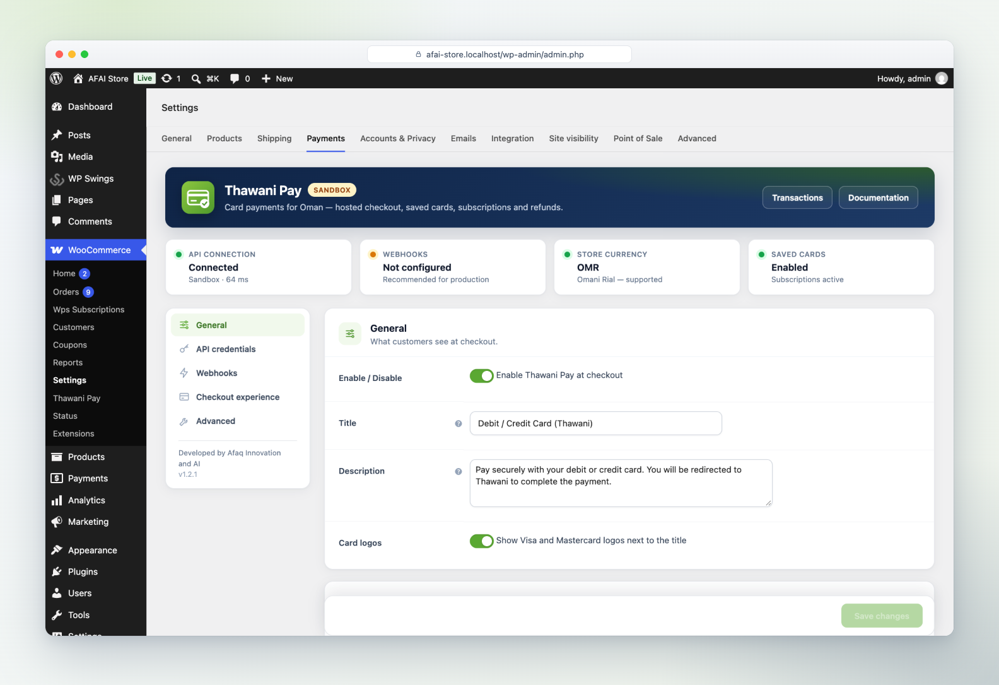
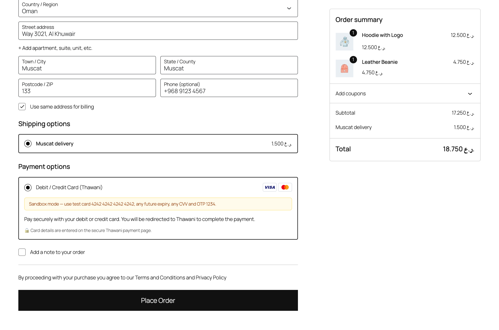
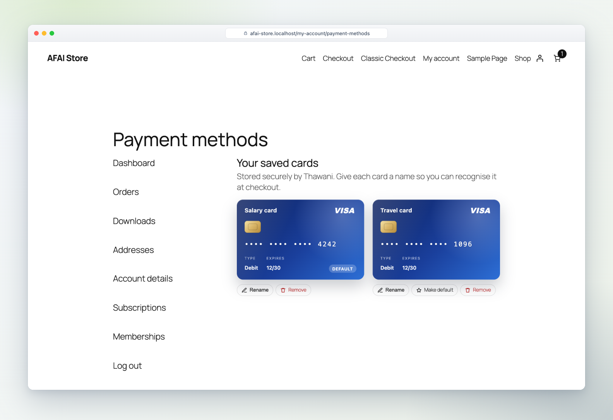
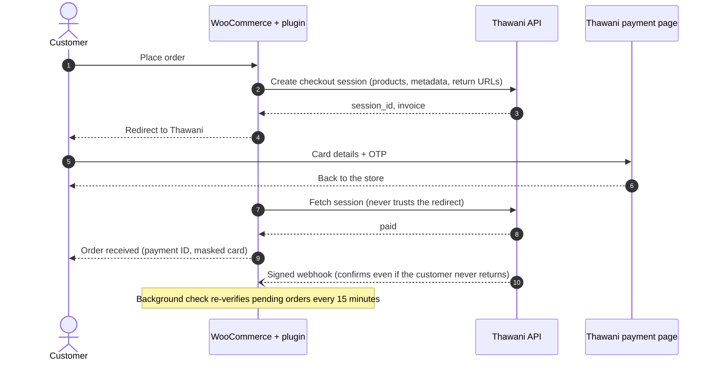

<p align="center">
  
</p>

<p align="center">
  <b>English</b> · <a href="README.ar.md">العربية</a>
</p>

<p align="center">
  <a href="https://github.com/afaq-innovation-ai/thawani-pay-for-woocommerce/actions/workflows/ci.yml"></a>
  <a href="https://github.com/afaq-innovation-ai/thawani-pay-for-woocommerce/releases/latest"></a>
  
  
  
  
</p>

<h3 align="center">Accept Omani debit and credit cards in WooCommerce, the professional way.</h3>

<p align="center">
  Your customers pay on Thawani's secure page, come back to a confirmed order, and you manage everything —<br>
  refunds, saved cards, subscriptions and live transactions — without leaving WordPress.
</p>

<p align="center">
  <a href="https://github.com/afaq-innovation-ai/thawani-pay-for-woocommerce/releases/latest"><b>⬇️ Download the latest release</b></a>
  &nbsp;·&nbsp;
  <a href="#-get-started-in-5-minutes"><b>🚀 Get started</b></a>
  &nbsp;·&nbsp;
  <a href="#-tour"><b>📸 Screenshots</b></a>
</p>

<p align="center">
  
</p>

---

## ✨ What it does

<table>
<tr>
<td width="33%" valign="top">

### 💳 Card payments in OMR
Customers pay with Visa and Mastercard debit or credit cards on Thawani's secure hosted page. No card data ever touches your server.

</td>
<td width="33%" valign="top">

### ✅ No lost payments
Every order is confirmed three ways: when the customer returns, by a signed webhook, and by a background check. It still works if the customer closes the tab.

</td>
<td width="33%" valign="top">

### ↩️ One-click refunds
Full or partial refunds straight from the WooCommerce order screen. The money goes back through Thawani and the refund ID is saved on the order.

</td>
</tr>
<tr>
<td valign="top">

### 🔁 Saved cards wallet
Saved cards appear as real bank cards under *My account*: brand colours, name, last digits and expiry. Customers can rename, set a default or remove them, and pick one at checkout straight from the card itself.

</td>
<td valign="top">

### 📅 Subscriptions
Monthly or yearly plans with the free *Subscriptions for WooCommerce* plugin. Renewals charge the saved card, and send a payment link if an OTP is needed.

</td>
<td valign="top">

### 📊 Transactions dashboard
Live view of Thawani checkout sessions: collected amount, paid, awaiting and cancelled, with search and filters, each linked to its order.

</td>
</tr>
<tr>
<td valign="top">

### 🧾 Clear order details
A Thawani panel on every order: amount, status, card, payment ID, invoice, refunds, plus a *Sync with Thawani* button.

</td>
<td valign="top">

### 🛡️ Secure by design
The plugin checks every payment with the Thawani API instead of trusting the browser. It also verifies amounts, checks webhook signatures and blocks duplicate charges.

</td>
<td valign="top">

### 🇴🇲 Arabic & RTL
Complete Arabic translation of the settings, checkout, emails and notes, with right-to-left layout out of the box.

</td>
</tr>
<tr>
<td valign="top">

### 🧱 Any checkout
Works with the modern WooCommerce block checkout and the classic shortcode checkout. Compatible with HPOS.

</td>
<td valign="top">

### 🧪 Sandbox built in
Test immediately with Thawani's public sandbox keys and test cards. Switch to live with one toggle when Thawani approves you.

</td>
<td valign="top">

### ⚙️ Setup in minutes
A settings screen with a live health panel shows the API connection, webhooks, currency and saved cards status at a glance.

</td>
</tr>
</table>

---

## 📸 Tour

### For the store owner

<table>
<tr>
<td width="50%" valign="top">

<p align="center"><b>Settings with live health panel</b><br><sub>API connection, webhooks, currency and saved cards at a glance.</sub></p>
</td>
<td width="50%" valign="top">

<p align="center"><b>Transactions dashboard</b><br><sub>Collected amount, statuses, search and filters, linked to orders.</sub></p>
</td>
</tr>
<tr>
<td valign="top">

<p align="center"><b>Thawani panel on every order</b><br><sub>Amount, card, payment ID, invoice and a full timeline in the notes.</sub></p>
</td>
<td valign="top">

<p align="center"><b>One-click refunds</b><br><sub>Partial refund processed through Thawani and recorded on the order.</sub></p>
</td>
</tr>
</table>

### For the customer

<table>
<tr>
<td width="50%" valign="top">

<p align="center"><b>1 · Checkout</b><br><sub>Clear card payment option with Visa and Mastercard logos.</sub></p>
</td>
<td width="50%" valign="top">

<p align="center"><b>2 · Thawani secure page</b><br><sub>Itemised order summary: products and shipping.</sub></p>
</td>
</tr>
<tr>
<td valign="top">

<p align="center"><b>3 · Bank OTP</b><br><sub>The cardholder confirms with the code from their bank.</sub></p>
</td>
<td valign="top">

<p align="center"><b>4 · Confirmed order</b><br><sub>Masked card and Thawani payment ID on the thank-you page.</sub></p>
</td>
</tr>
</table>

### Saved cards wallet

<p align="center">
  
  <br><b>Saved cards shown as bank cards</b><br><sub>Brand colours, card name, last digits, type and expiry, with Default and Expired badges.</sub>
</p>

<table>
<tr>
<td width="33%" valign="top">

<p align="center"><b>Rename any card</b><br><sub>“Salary card”, “Travel card”… shown everywhere, including checkout.</sub></p>
</td>
<td width="33%" valign="top">

<p align="center"><b>Pick a card at checkout</b><br><sub>Saved cards appear as cards on the block and classic checkout. One click, then the bank OTP.</sub></p>
</td>
<td width="33%" valign="top">

<p align="center"><b>Saved securely at Thawani</b><br><sub>The name chosen on Thawani's page is imported automatically.</sub></p>
</td>
</tr>
</table>

### Subscriptions

<table>
<tr>
<td width="33%" valign="top">

<p align="center"><b>Subscribe</b><br><sub>The card is saved for renewals.</sub></p>
</td>
<td width="33%" valign="top">

<p align="center"><b>Renewal link</b><br><sub>Sent automatically when an OTP is needed.</sub></p>
</td>
<td width="33%" valign="top">

<p align="center"><b>Full renewal timeline</b><br><sub>Every step recorded on the order.</sub></p>
</td>
</tr>
</table>

### العربية — Arabic

<table>
<tr>
<td width="50%" valign="top">

<p align="center"><b>Checkout in Arabic</b></p>
</td>
<td width="50%" valign="top">

<p align="center"><b>Settings in Arabic (RTL)</b></p>
</td>
</tr>
<tr>
<td colspan="2" valign="top">

<p align="center"><b>Saved cards wallet in Arabic</b></p>
</td>
</tr>
</table>

---

## 🚀 Get started in 5 minutes

**Before you start:** WordPress 6.2+, WooCommerce 8.0+, PHP 7.4+, and your store currency set to **Omani Rial (OMR)**.

1. **Install.** Download the zip from [Releases](https://github.com/afaq-innovation-ai/thawani-pay-for-woocommerce/releases/latest). In WordPress, go to **Plugins → Add New → Upload Plugin** and click **Activate**.
2. **Open the settings.** Go to **WooCommerce → Settings → Payments → Thawani Pay** and switch on **Enable Thawani Pay at checkout**.
3. **Try it in the sandbox.** The sandbox keys are already filled in. Place a test order and pay with card `4242 4242 4242 4242`, any future expiry, any CVV and OTP `1234`.
4. **Connect webhooks** (recommended). Copy the **Webhook URL** from the settings into the Thawani merchant portal, then paste the webhook secret back into the plugin.
5. **Go live.** When Thawani sends your production keys, paste them into the **Live** fields, click **Test live keys**, and turn off **Sandbox mode**.

<details>
<summary><b>Sandbox test cards</b></summary>

| Card number | Result | OTP |
|---|---|---|
| `4242 4242 4242 4242` | Always accepted | `1234` |
| `4000 0000 0000 0002` | Always declined | `1234` |
| `4456 5300 0000 1096` | 3-D Secure (credit), accepted | `1234` |
| `4456 5300 0000 1104` | 3-D Secure (credit), declined | `1234` |

Use any future expiry date and any CVV.
</details>

<details>
<summary><b>Thawani go-live checklist, and how the plugin meets it</b></summary>

| Thawani requirement | Covered by |
|---|---|
| SSL certificate | An admin warning appears if live mode is on without HTTPS. |
| Customer name, contact number and email in metadata | Sent automatically with every payment. |
| Checkout states that cards are accepted | Default title *Debit / Credit Card (Thawani)*, description and card logos. |
| Webhook URL configured | Copyable URL in the settings; every delivery is verified with the webhook secret. |
</details>

<details>
<summary><b>Setting up subscriptions</b></summary>

1. Install and activate the free **[Subscriptions for WooCommerce](https://wordpress.org/plugins/subscriptions-for-woocommerce/)** plugin by WP Swings.
2. Create a subscription product, for example 5 OMR a month.
3. That's it. Thawani Pay is offered at checkout for subscriptions, saves the card, and charges it on each renewal.

Thawani currently asks the cardholder for an OTP on every saved-card charge. When a renewal needs one, the subscription goes
on hold and the customer receives an email with a **Pay for this order** link. One click and the OTP re-activate it. If
Thawani enables charges without OTP on your account, renewals become fully automatic with no change on your side.

The official paid *WooCommerce Subscriptions* extension is not supported yet.
</details>

---

## 🔒 Reliability and security

- **Never trusts the browser.** The plugin updates an order only after confirming the payment with the Thawani API.
- **Amount check.** If the paid amount differs from the order total, the order goes *on hold* instead of shipping.
- **Paid exactly once.** A lock prevents double-processing when the redirect, the webhook and the background check arrive together.
- **Signed webhooks.** HMAC-SHA256 signatures, checked in constant time, with replay protection.
- **No stale payment links.** When an order changes, the old Thawani session is cancelled so it can't be paid by mistake.
- **Private logs.** Keys, emails and phone numbers are masked in the debug log.
- **PCI scope stays with Thawani.** WooCommerce keeps only the card brand, last four digits and expiry.

<details>
<summary><b>How a payment flows (diagram)</b></summary>


</details>

---

## 🧑‍💻 For developers

<details>
<summary><b>Hooks, endpoints, order meta and architecture</b></summary>

#### Filters

| Filter | Arguments | Purpose |
|---|---|---|
| `thawani_pay_checkout_session_payload` | `array $payload, WC_Order $order` | Change the checkout session request, e.g. a custom `expire_in_minutes`. |
| `thawani_pay_payment_intent_payload` | `array $payload, WC_Order $order` | Change the saved-card payment intent request. |
| `thawani_pay_metadata` | `array $meta, WC_Order $order` | Add or remove metadata sent to Thawani (string values, 250 characters max). |
| `thawani_pay_supported_currencies` | `string[] $currencies` | Currencies for which the method is offered (default `['OMR']`). |
| `thawani_pay_api_host` | `string $host, string $mode` | Point the client at a proxy or mock server. |
| `thawani_pay_force_save_card` | `bool $save, WC_Order $order` | Always save the card for an order (used by the subscriptions integration). |
| `thawani_pay_show_save_option` | `bool $show` | Show or hide the *save my card* checkbox at checkout. |
| `thawani_pay_checkout_description` | `string $description` | Change the text under the payment method (classic and block checkout). |
| `thawani_pay_order_box_rows` | `array $rows, WC_Order $order` | Add rows to the Thawani Pay box on the order screen. |

#### Actions

| Action | Arguments | Fired when |
|---|---|---|
| `thawani_pay_payment_completed` | `WC_Order $order, ?array $payment` | An order has been confirmed as paid. |
| `thawani_pay_refund_created` | `WC_Order $order, array $refund, int $baisa` | A refund was accepted by Thawani. |
| `thawani_pay_webhook_received` | `string $event, array $data` | A webhook passed signature verification. |
| `thawani_pay_renewal_requires_customer` | `WC_Order $order, int $subscription_id, string $reason` | A renewal could not be charged automatically and the customer was sent a payment link. |

```php
// Example: add the customer's loyalty tier to the Thawani metadata.
add_filter( 'thawani_pay_metadata', function ( array $meta, WC_Order $order ) {
    $meta['Loyalty tier'] = get_user_meta( $order->get_customer_id(), 'loyalty_tier', true );
    return $meta;
}, 10, 2 );
```

#### Endpoints

| Endpoint | Purpose |
|---|---|
| `POST /wp-json/thawani-pay/v1/webhook` | Thawani webhooks (`checkout.completed`, `payment.succeeded`, `payment.failed`, …). |
| `GET /wp-json/thawani-pay/v1/order-status?order_id=&key=` | Status polling for the thank-you page (requires the order key). |
| `/?wc-api=thawani_return&thawani_action=success\|cancel\|intent` | Where Thawani sends the customer back. |

#### Order meta

| Key | Content |
|---|---|
| `_thawani_mode` | `test` or `live` — the environment the order was paid in. |
| `_thawani_session_id` / `_thawani_invoice` / `_thawani_reference` | Checkout session, Thawani invoice and our `client_reference_id`. |
| `_thawani_intent_id` | Payment intent (saved-card orders). |
| `_thawani_payment_id` | Thawani payment ID (also stored as the WooCommerce transaction ID). |
| `_thawani_masked_card` / `_thawani_card_type` | e.g. `4242 42XX XXXX 4242` / `Debit`. |
| `_thawani_card_id` | Thawani id of the saved card that paid the order (also stored on subscriptions). |
| `_thawani_amount` | Expected amount in baisa. |
| `_thawani_refunds` | Refunds created through the plugin. |

#### Architecture

```
src/
├── Api/            Client.php (the whole Thawani E-Commerce API), ApiException.php
├── Gateway/        Gateway.php, CheckoutService.php, PaymentSync.php, ReturnHandler.php, ThankYou.php, OrderMeta.php
├── Webhooks/       WebhookController.php, Signature.php
├── Tokens/         TokenManager.php (Thawani customers + saved cards ⇄ WooCommerce tokens)
├── Cron/           Reconciler.php (Action Scheduler)
├── Blocks/         BlocksSupport.php (Cart & Checkout blocks)
├── Subscriptions/  WpsSubscriptions.php (Subscriptions for WooCommerce by WP Swings)
├── Admin/          Admin.php, Status.php (health panel), OrderMetaBox.php, TransactionsPage.php
└── Support/        Settings.php, Money.php (OMR ⇄ baisa), LineItems.php, Logger.php
```
</details>

<details>
<summary><b>Local development, tests and releases</b></summary>

The repository includes a Docker stack (WordPress, MariaDB, WP-CLI and Mailpit) that works with OrbStack or Docker Desktop.

```bash
cd dev && docker compose up -d
docker compose exec cli wp core install --url=http://localhost:8090 --title="Dev Store" \
  --admin_user=admin --admin_password=admin --admin_email=dev@example.test --skip-email
docker compose exec cli wp plugin install woocommerce --activate
docker compose exec cli wp option update woocommerce_currency OMR
docker compose exec cli wp plugin activate thawani-pay-for-woocommerce
```

| Service | URL |
|---|---|
| Store and admin | http://localhost:8090 (admin / admin) |
| Mailpit (outgoing email) | http://localhost:8026 |

```bash
composer install && composer test && composer lint     # unit tests + WordPress Coding Standards
cd tests/e2e && npm install
node seed.mjs            # realistic demo orders through the Thawani sandbox
node screenshots.mjs     # full end-to-end run; regenerates docs/screenshots
node subscriptions.mjs   # subscribe → renewal → OTP link → re-activation
bin/build-zip.sh         # → dist/thawani-pay-for-woocommerce-<version>.zip
```

Pushing a tag such as `v1.2.0` makes GitHub Actions build the zip and publish a release.
</details>

<details>
<summary><b>Troubleshooting</b></summary>

| Symptom | Fix |
|---|---|
| Thawani Pay is not shown at checkout | The store currency must be **OMR**, and keys must be set for the active environment. The health panel shows both. |
| "Key rejected by Thawani" | Live keys are being used in sandbox mode, or the other way round. Check the **Sandbox mode** switch. |
| Order stays *Pending payment* after paying | Click **Sync with Thawani** on the order, and set up webhooks. Also check *Tools → Scheduled Actions* (group `thawani-pay`). |
| Webhooks return `401 invalid_signature` | The webhook secret in the plugin does not match the Thawani portal for that environment. |
| I need to see the raw API traffic | Enable **Debug log** and open *WooCommerce → Status → Logs* (source `thawani-pay`). |
</details>

---

## 🤝 Credits and license

Developed and maintained by **Afaq Innovation and AI** · آفاق الابتكار والذكاء الاصطناعي.

Released under the [GNU General Public License v2.0 or later](LICENSE). See [CHANGELOG.md](CHANGELOG.md) for release
notes, [CONTRIBUTING.md](CONTRIBUTING.md) to contribute, and [SECURITY.md](SECURITY.md) to report a vulnerability.

<sub>Thawani and the Thawani logo are trademarks of Thawani Technologies. This is an independent integration built on the
public Thawani E-Commerce API; Thawani Technologies does not endorse or support it.</sub>
