<p align="center">
  
</p>

<p align="center">
  <a href="https://github.com/afaq-innovation-ai/thawani-pay-for-woocommerce/actions/workflows/ci.yml"></a>
  
  
  
  
  
</p>

<p align="center">
  <b>Accept Omani debit and credit cards in WooCommerce through Thawani Checkout.</b><br>
  Hosted payment page · saved cards · subscriptions · one-click refunds · signed webhooks · automatic reconciliation · Arabic &amp; RTL
</p>

<p align="center" dir="rtl">
  اقبل مدفوعات البطاقات البنكية والائتمانية بالريال العماني في متجرك عبر بوابة ثواني.
</p>

---

## Contents

- [Why this plugin](#why-this-plugin)
- [Features](#features)
- [How a payment flows](#how-a-payment-flows)
- [Requirements](#requirements)
- [Installation](#installation)
- [Setup, step by step](#setup-step-by-step)
- [The customer experience](#the-customer-experience)
- [Saved cards](#saved-cards)
- [Subscriptions](#subscriptions)
- [Managing orders and refunds](#managing-orders-and-refunds)
- [Arabic and RTL](#arabic-and-rtl)
- [Testing in the sandbox](#testing-in-the-sandbox)
- [Going live](#going-live)
- [Reliability and security](#reliability-and-security)
- [Developer reference](#developer-reference)
- [Local development](#local-development)
- [Troubleshooting](#troubleshooting)
- [Credits and license](#credits-and-license)

---

## Why this plugin

Thawani is one of Oman's leading payment gateways, but it does not publish an official WooCommerce plugin. This plugin
covers the whole Thawani E-Commerce API and follows WooCommerce best practice. Every flow in this README was run against
the Thawani UAT sandbox, and every screenshot comes from a real run.

## Features

| | |
|---|---|
| **Hosted checkout** | Customers pay on Thawani's PCI-compliant page (cards, Google Pay where available). No card data touches your server. |
| **Block and classic checkout** | Native integration with the WooCommerce Cart & Checkout blocks and the classic `[woocommerce_checkout]` shortcode. |
| **Itemised order summary** | Products, shipping and fees appear line by line on the Thawani page. It falls back to a single line when needed, so the total always matches. |
| **Saved cards** | Logged-in customers can save a card at Thawani and pay with it next time (Payment Intents + OTP / 3-D Secure). Cards appear under *My account → Payment methods*. |
| **Subscriptions** | Recurring payments with [Subscriptions for WooCommerce](https://wordpress.org/plugins/subscriptions-for-woocommerce/) (WP Swings): the card is saved at sign-up and charged on every renewal, with an automatic payment link when Thawani needs the customer's OTP. |
| **Refunds** | Full and partial refunds from the order screen through the Thawani Refunds API. |
| **Three confirmation paths** | The customer's return, signed webhooks and a background reconciler. An order gets paid even when the customer closes the tab. |
| **Signed webhooks** | HMAC-SHA256 verification of `thawani-signature`, replay protection, and a re-fetch from the API before any status change. |
| **Transactions screen** | *WooCommerce → Thawani Pay* lists live checkout sessions from the API, linked to your orders. |
| **Order details box** | Payment ID, card, invoice, session and refunds on every order, plus a one-click **Sync with Thawani** button. |
| **Sandbox and live** | Separate keys and webhook secrets. Each order remembers its environment, so refunds always go to the right one. |
| **Connection test** | Validate keys from the settings screen before saving. |
| **Arabic and RTL** | Complete Arabic translation for the admin, the checkout (PHP and JavaScript) and order notes. |
| **HPOS** | Compatible with WooCommerce High-Performance Order Storage. |
| **Built for developers** | Filters and actions at every step, PSR-4 code, WordPress Coding Standards, PHPUnit tests and CI. |

## How a payment flows

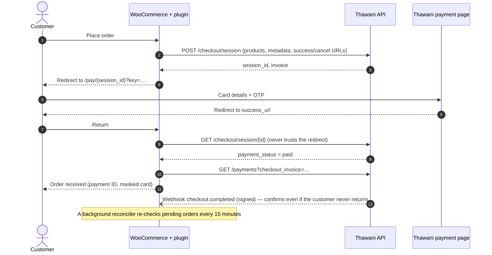

## Requirements

| | Minimum | Tested up to |
|---|---|---|
| WordPress | 6.2 | 7.1 |
| WooCommerce | 8.0 | 11.1 |
| PHP | 7.4 | 8.3 (syntax-checked on 7.4 – 8.4 in CI) |
| Store currency | Omani Rial (OMR) | — |
| Thawani | Merchant account with Integration Keys (sandbox keys are built in) | — |

## Installation

**From a release zip (recommended)**

1. Download `thawani-pay-for-woocommerce-x.y.z.zip` from the [Releases](../../releases) page.
2. In WordPress go to **Plugins → Add New → Upload Plugin**, choose the zip and click **Install Now**.
3. Click **Activate**.

**From source**

```bash
cd wp-content/plugins
git clone https://github.com/afaq-innovation-ai/thawani-pay-for-woocommerce.git
```

The plugin has no runtime Composer or npm dependencies, so you can activate it straight after cloning.

## Setup, step by step

### 1. Activate the plugin

After activation the plugin adds **Settings**, **Transactions** and **Documentation** links to the Plugins screen.

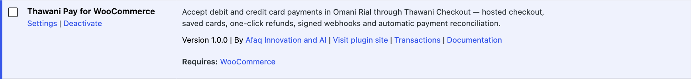

### 2. Open the payment method

Go to **WooCommerce → Settings → Payments**. Thawani Pay appears in the list with a *Test mode* badge while the sandbox
is active. Click **Manage**.

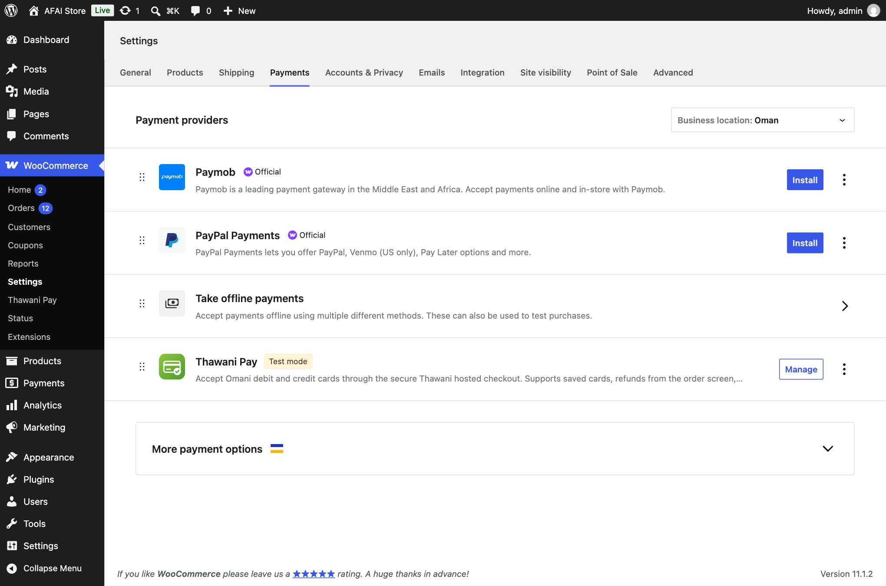

### 3. General settings

Enable the method and adjust the title and description customers see. Thawani requires the checkout to state that card
payments are accepted, and the default description already does.

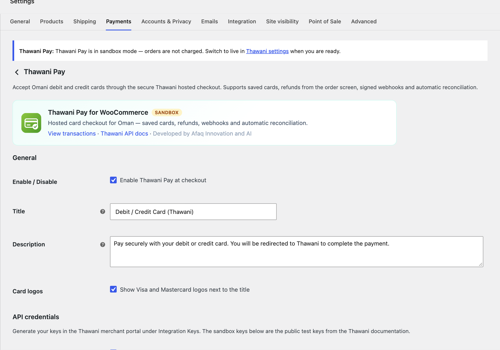

### 4. API keys and the connection test

The plugin ships with the public UAT keys from the Thawani documentation, so you can try it straight away. When Thawani
issues your production keys, paste them into the **Live** fields.

Click **Test sandbox keys** (or **Test live keys**) to check the keys against the API without saving the form.

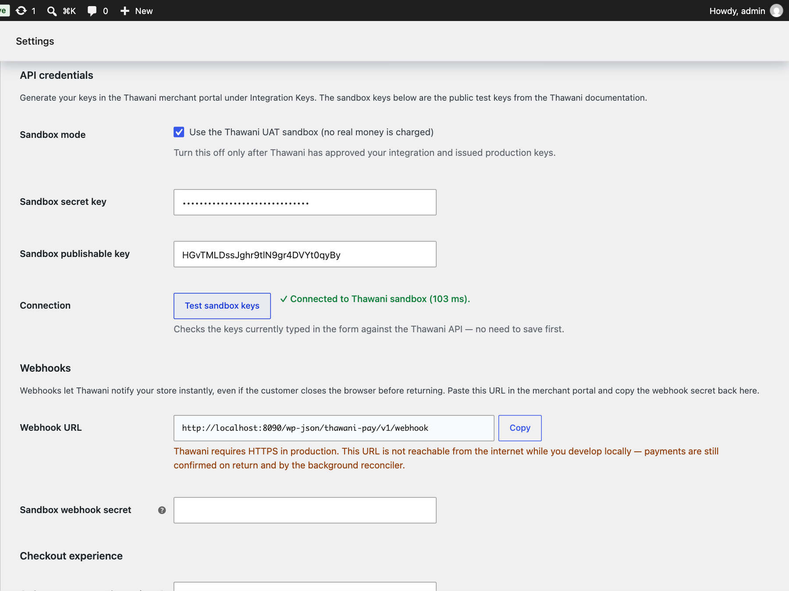

### 5. Webhooks and checkout options

1. Copy the **Webhook URL** (`https://your-store/wp-json/thawani-pay/v1/webhook`).
2. In the Thawani merchant portal, open **Webhook URL**, paste it, and generate a webhook secret.
3. Paste the secret into **Sandbox webhook secret** or **Live webhook secret**.

This screen also sets how the order summary appears on Thawani (*itemised* or *single line*), whether saved cards are
allowed, and the lifetime of the payment link (30 minutes to 7 days).

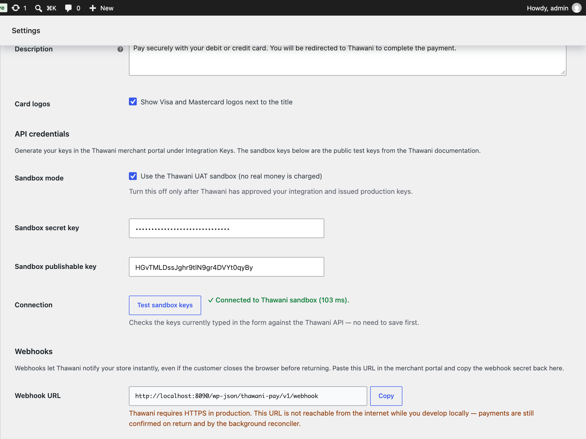

> **Tip:** webhooks are strongly recommended in production, but they are not strictly required. Payments are also
> confirmed when the customer returns and by the background reconciler.

## The customer experience

### Block checkout

The payment method appears with Visa and Mastercard logos. In sandbox mode a notice shows the test card to use.


### Thawani payment page

The customer lands on the Thawani hosted page, with the itemised order summary on the left.


The bank confirms the payment with an OTP (in the sandbox the OTP is always `1234`).


### Order received

Back in the store, the order is already confirmed by the API. The thank-you page shows the masked card and the Thawani
payment ID. If the bank is still processing, the page shows a live *Confirming your payment…* panel that updates itself.


### Classic checkout

Stores that use the `[woocommerce_checkout]` shortcode get the same experience.

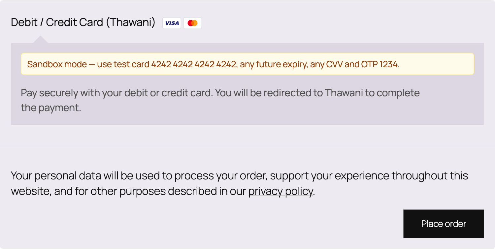

### If the customer cancels

The cart is kept, the session is closed at Thawani, and the customer can try again at once. The order stays *Pending
payment*, so staff do not receive a "Failed order" email for a simple change of mind.

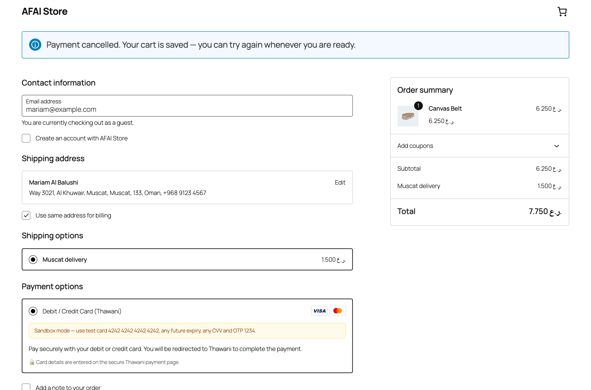

## Saved cards

Enable **Saved cards** in the settings. Logged-in customers then see a **Save payment information** option.

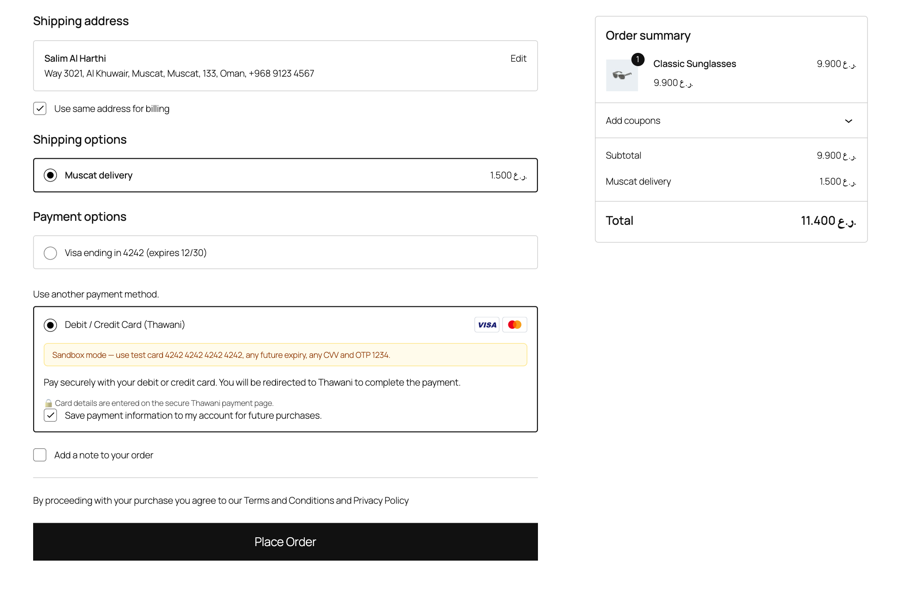

Thawani stores the card; the customer gives it a nickname on the Thawani page.


The card appears under **My account → Payment methods**. Deleting it there also deletes it at Thawani. If Thawani
holds duplicates of the same card, the list shows it once.


Next time, the customer picks the saved card and places the order…


…and only has to authorise the payment with the OTP. There is no need to type the card number again.

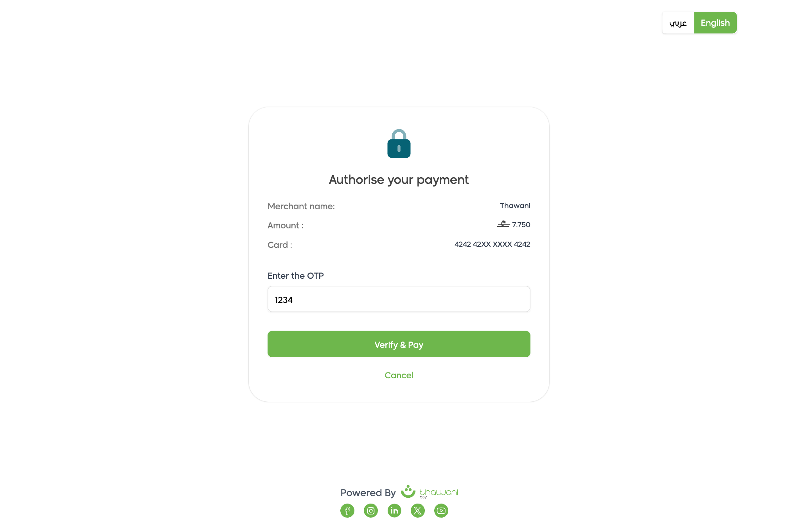

> Saved cards are scoped per environment: sandbox cards never show up in live mode, and the other way round.

## Subscriptions

Thawani Pay works with the free **[Subscriptions for WooCommerce](https://wordpress.org/plugins/subscriptions-for-woocommerce/)**
plugin by WP Swings. Install and enable it, create a subscription product, and Thawani Pay is offered for subscription
carts automatically. There is nothing to configure in Thawani Pay.

### How renewals are charged

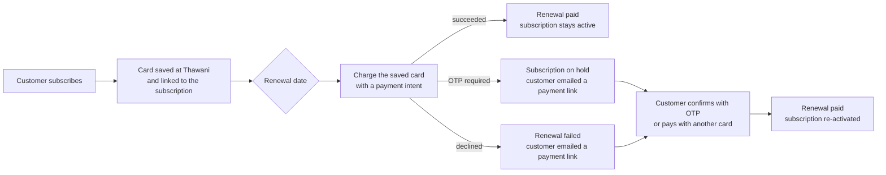

> **About the OTP.** Thawani currently asks the cardholder for an OTP on every saved-card charge, including charges the
> store starts, so most renewals take the *payment link* path. The customer clicks once, confirms with the OTP and the
> subscription is active again. If Thawani enables charges without OTP on your merchant account, renewals become fully
> automatic with no change on your side. The plugin already handles the *succeeded* path.

### Walkthrough

At checkout the payment method explains that the card will be saved for renewals. The card is always saved for
subscriptions, so the opt-in checkbox is hidden.


After payment the subscription is **Active** under *My account → Subscriptions*, and the card used is linked to it.

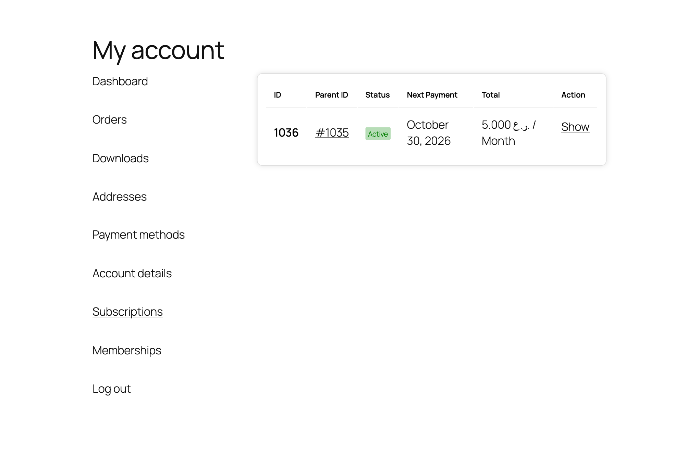

On the renewal date the plugin charges the saved card. When Thawani asks for the OTP, the customer receives the
WooCommerce *order details* email with a **Pay for this order** link:


The link opens the renewal order with the saved card pre-selected. One click, the OTP, and it is paid:

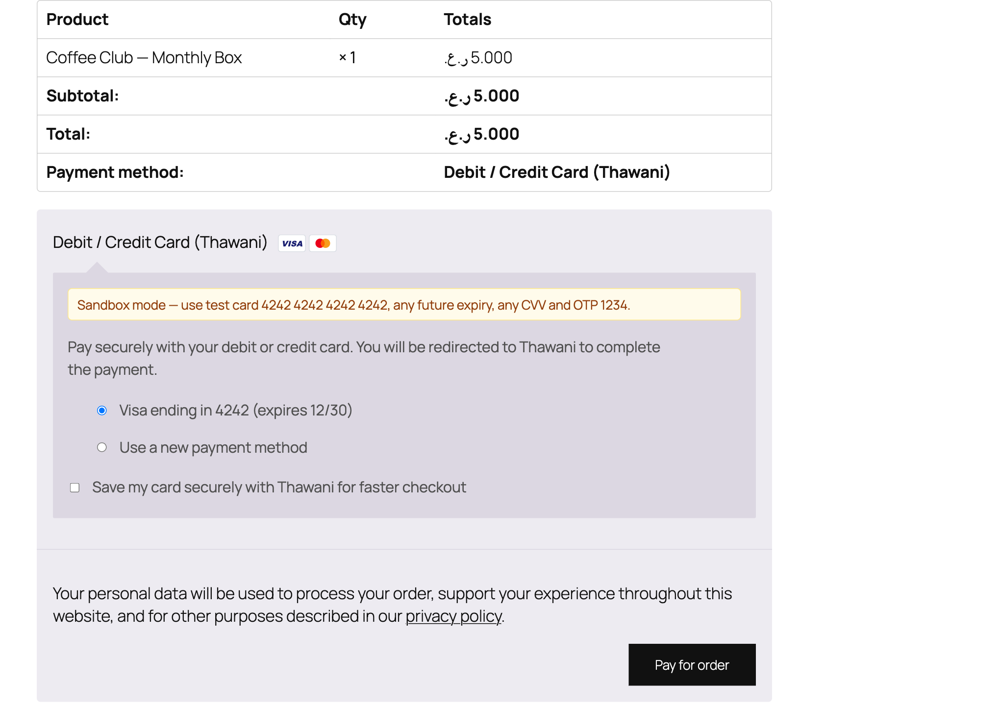

The order notes record every step, and the Thawani box shows which subscription the order renews. Once the renewal is
paid, the subscription is re-activated automatically.


**Good to know**

- **Paying with a different card.** If a renewal is paid with a different card, that card becomes the one charged for
  future renewals.
- **Cancelling.** Cancelling a subscription only stops future renewals; nothing is scheduled at Thawani.
- **Official WooCommerce Subscriptions.** The official (paid) *WooCommerce Subscriptions* extension is not supported
  yet.

## Managing orders and refunds

### Order screen

Every Thawani order has a **Thawani Pay** box with the environment, payment status, payment ID, card, invoice, session
and reference. **Sync with Thawani** pulls the authoritative state on demand. Order notes record every step.


### Refunds

Click **Refund**, enter the amount (full or partial) and choose **Refund … via Thawani Pay**. The refund goes to Thawani
immediately. Its ID and status are stored on the order and shown in the box.


### Transactions

**WooCommerce → Thawani Pay** lists checkout sessions straight from the Thawani API, linked to their orders. Switch
between **Sandbox** and **Live**, and between **This store** and the **Entire Thawani account** (useful when one merchant
account serves several shops).


## Arabic and RTL

The plugin ships with a complete Arabic translation (`languages/thawani-pay-for-woocommerce-ar.*`). This covers the
checkout blocks, which read translations from a JSON file. With the site language set to Arabic, everything switches to
right-to-left automatically.

| Checkout (عربي) | Settings (عربي) |
|---|---|
|  |  |

## Testing in the sandbox

Sandbox mode is on by default and uses `https://uatcheckout.thawani.om`. Use any future expiry date and any CVV.

| Card number | Result | OTP |
|---|---|---|
| `4242 4242 4242 4242` | Always accepted | `1234` |
| `4000 0000 0000 0002` | Always declined | `1234` |
| `4456 5300 0000 1096` | 3-D Secure (credit), accepted | `1234` |
| `4456 5300 0000 1104` | 3-D Secure (credit), declined | `1234` |

## Going live

Thawani reviews every integration before it issues production keys. Their checklist and how this plugin meets it:

| Thawani requirement | How it is covered |
|---|---|
| SSL certificate | The plugin shows an admin warning if live mode is active without HTTPS. |
| Customer name, contact number and email address in metadata | Sent automatically with every session and payment intent (`Customer name`, `Contact number`, `Email address`). |
| The checkout states that card payments are accepted | Default title *Debit / Credit Card (Thawani)*, default description and card logos. |
| Webhook URL configured | Copyable URL on the settings page; deliveries are verified with the webhook secret. |

Then:

1. Enter the **Live secret key**, **Live publishable key** and **Live webhook secret**.
2. Click **Test live keys**.
3. Untick **Sandbox mode** and save.
4. Place a small real order and refund it from the order screen.

## Reliability and security

- **Never trusts the browser.** Success redirects and webhook bodies are only hints. The order is updated only after the
  plugin fetches the session or payment intent from the Thawani API.
- **Amount check.** If Thawani reports an amount that differs from the order total, the order is put *on hold* with a
  note instead of being fulfilled.
- **Idempotent.** A per-order lock guarantees an order is marked paid exactly once, even when the redirect, the webhook
  and the reconciler arrive at the same moment.
- **Webhook signatures.** `HMAC-SHA256(body + "-" + thawani-timestamp, secret)` is compared in constant time. Deliveries
  older than 10 minutes are rejected (replay protection).
- **Order-key protection.** Return URLs and the status-polling endpoint require the WooCommerce order key.
- **No duplicate invoices.** Clicking *Place order* twice reuses the open session while it is still valid.
- **Automatic retries.** Read requests are retried with back-off on network errors, HTTP 429 and 5xx. Requests that
  create something are never retried, so a customer is never charged twice.
- **Private logs.** With debug logging on, API traffic is written to *WooCommerce → Status → Logs* (source
  `thawani-pay`). Keys, emails and phone numbers are masked.
- **PCI scope.** Card data is entered only on Thawani's pages. Saved cards live at Thawani; WooCommerce keeps only the
  card ID, brand, last four digits and expiry.

## Developer reference

### Filters

| Filter | Arguments | Purpose |
|---|---|---|
| `thawani_pay_checkout_session_payload` | `array $payload, WC_Order $order` | Change the checkout session request, e.g. a custom `expire_in_minutes`. |
| `thawani_pay_payment_intent_payload` | `array $payload, WC_Order $order` | Change the saved-card payment intent request. |
| `thawani_pay_metadata` | `array $meta, WC_Order $order` | Add or remove metadata sent to Thawani (string values, 250 characters max). |
| `thawani_pay_supported_currencies` | `string[] $currencies` | Currencies for which the method is offered (default `['OMR']`). |
| `thawani_pay_api_host` | `string $host, string $mode` | Point the client at a proxy or mock server. |
| `thawani_pay_force_save_card` | `bool $save, WC_Order $order` | Always save the card for an order (used by the subscriptions integration). |
| `thawani_pay_show_save_option` | `bool $show` | Show or hide the *save my card* checkbox at checkout. |
| `thawani_pay_checkout_description` | `string $description` | Change the text under the payment method (classic and block checkout). |
| `thawani_pay_order_box_rows` | `array $rows, WC_Order $order` | Add rows to the Thawani Pay box on the order screen. |

### Actions

| Action | Arguments | Fired when |
|---|---|---|
| `thawani_pay_payment_completed` | `WC_Order $order, ?array $payment` | An order has been confirmed as paid. |
| `thawani_pay_refund_created` | `WC_Order $order, array $refund, int $baisa` | A refund was accepted by Thawani. |
| `thawani_pay_webhook_received` | `string $event, array $data` | A webhook passed signature verification. |
| `thawani_pay_renewal_requires_customer` | `WC_Order $order, int $subscription_id, string $reason` | A renewal could not be charged automatically and the customer was sent a payment link. |

```php
// Example: add the customer's loyalty tier to the Thawani metadata.
add_filter( 'thawani_pay_metadata', function ( array $meta, WC_Order $order ) {
    $meta['Loyalty tier'] = get_user_meta( $order->get_customer_id(), 'loyalty_tier', true );
    return $meta;
}, 10, 2 );
```

### Endpoints

| Endpoint | Purpose |
|---|---|
| `POST /wp-json/thawani-pay/v1/webhook` | Thawani webhooks (`checkout.completed`, `payment.succeeded`, `payment.failed`, …). |
| `GET /wp-json/thawani-pay/v1/order-status?order_id=&key=` | Status polling for the thank-you page (requires the order key). |
| `/?wc-api=thawani_return&thawani_action=success\|cancel\|intent` | Where Thawani sends the customer back. |

### Order meta

| Key | Content |
|---|---|
| `_thawani_mode` | `test` or `live` — the environment the order was paid in. |
| `_thawani_session_id` / `_thawani_invoice` / `_thawani_reference` | Checkout session, Thawani invoice and our `client_reference_id`. |
| `_thawani_intent_id` | Payment intent (saved-card orders). |
| `_thawani_payment_id` | Thawani payment ID (also stored as the WooCommerce transaction ID). |
| `_thawani_masked_card` / `_thawani_card_type` | e.g. `4242 42XX XXXX 4242` / `Debit`. |
| `_thawani_card_id` | Thawani id of the saved card that paid the order (also stored on subscriptions). |
| `_thawani_amount` | Expected amount in baisa. |
| `_thawani_refunds` | Refunds created through the plugin. |

### Architecture

```
src/
├── Api/            Client.php (the whole Thawani E-Commerce API), ApiException.php
├── Gateway/        Gateway.php, CheckoutService.php, PaymentSync.php, ReturnHandler.php, ThankYou.php, OrderMeta.php
├── Webhooks/       WebhookController.php, Signature.php
├── Tokens/         TokenManager.php (Thawani customers + saved cards ⇄ WooCommerce tokens)
├── Cron/           Reconciler.php (Action Scheduler)
├── Blocks/         BlocksSupport.php (Cart & Checkout blocks)
├── Subscriptions/  WpsSubscriptions.php (Subscriptions for WooCommerce by WP Swings)
├── Admin/          Admin.php, OrderMetaBox.php, TransactionsPage.php
└── Support/        Settings.php, Money.php (OMR ⇄ baisa), LineItems.php, Logger.php
```

## Local development

The repository includes a complete Docker stack (WordPress, MariaDB, WP-CLI and Mailpit). It works with OrbStack or
Docker Desktop.

```bash
cd dev
docker compose up -d
docker compose exec cli wp core install --url=http://localhost:8090 --title="Dev Store" \
  --admin_user=admin --admin_password=admin --admin_email=dev@example.test --skip-email
docker compose exec cli wp plugin install woocommerce --activate
docker compose exec cli wp option update woocommerce_currency OMR
docker compose exec cli wp plugin activate thawani-pay-for-woocommerce
```

| Service | URL |
|---|---|
| Store and admin | http://localhost:8090 (admin / admin) |
| Mailpit (outgoing email) | http://localhost:8026 |

### Tests and coding standards

```bash
composer install
composer test        # PHPUnit: money conversion, line items, webhook signatures
composer lint        # WordPress Coding Standards + PHP 7.4 compatibility
```

### End-to-end run and screenshots

`tests/e2e/screenshots.mjs` drives a real browser through the full lifecycle against the Thawani sandbox: settings,
checkout, payment, OTP, refund, saved cards, cancellation, transactions and Arabic. It regenerates every image in
`docs/screenshots`.

```bash
cd tests/e2e && npm install && node screenshots.mjs
node subscriptions.mjs      # subscribe → renewal → OTP link → re-activation
```

### Building a release

```bash
bin/build-zip.sh     # → dist/thawani-pay-for-woocommerce-<version>.zip
```

Pushing a tag such as `v1.0.1` makes GitHub Actions build the zip and attach it to a GitHub release.

## Troubleshooting

| Symptom | Fix |
|---|---|
| Thawani Pay is not shown at checkout | The store currency must be **OMR**, and keys must be set for the active environment. The admin shows a notice for both. |
| "Key rejected by Thawani" | You are using live keys in sandbox mode or the other way round. Check the **Sandbox mode** switch. |
| Order stays *Pending payment* after paying | Open the order and click **Sync with Thawani**. Configure webhooks so this happens automatically. Check *Tools → Scheduled Actions* (group `thawani-pay`). |
| Webhooks return `401 invalid_signature` | The webhook secret in the plugin does not match the one in the Thawani portal for that environment. |
| Refund fails with "Refund is not allowed" | Thawani may require an amount for refunds made a day or more after payment. The plugin always sends one; check the payment is settled in the portal. |
| I need to see the raw API traffic | Enable **Debug log** and open *WooCommerce → Status → Logs*, source `thawani-pay`. |

## Credits and license

Developed and maintained by **Afaq Innovation and AI** (آفاق الابتكار والذكاء الاصطناعي).

Released under the [GNU General Public License v2.0 or later](LICENSE).

Thawani and the Thawani logo are trademarks of Thawani Technologies. This is an independent integration built on the
public Thawani E-Commerce API; Thawani Technologies does not endorse or support it.
